# Gym Sales Automation OS

**AI-powered sales, booking, retention, review, and campaign automation for gyms.**

Gym Sales Automation OS is a portfolio-grade automation system that turns inbound gym leads into a structured sales pipeline, books trial sessions, supports member retention, queues owner tasks, and prepares approval-based campaigns. It combines a polished owner dashboard with n8n workflow automation, OpenRouter AI calls, Google Sheets CRM storage, Gmail, Google Calendar, and a Cloudflare Worker webhook router.

> This project is designed as a professional MVP for demonstrating automation architecture, AI-assisted CRM workflows, and a production-minded frontend/backend experience.

## Highlights

- Lead intake, deduplication, AI qualification, scoring, and first follow-up routing
- Trial booking flow with Google Calendar event creation and confirmation emails
- Daily trial reminders, no-show handling, and post-trial follow-up
- Member onboarding, attendance updates, review requests, and retention-risk checks
- Reactivation and upsell campaign draft generation with owner approval gates
- Owner dashboard for pipeline, members, tasks, campaigns, and automation logs
- Cloudflare Worker router for clean public webhook endpoints
- Postman collection for repeatable API and webhook testing
- Beginner-friendly documentation for n8n, OpenRouter, Google Sheets, and Cloudflare Workers

## Product Preview

### Owner Dashboard

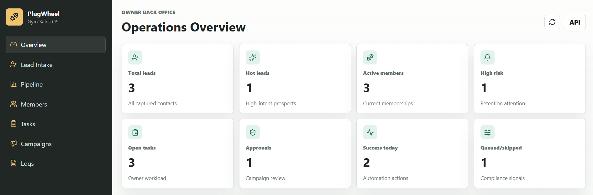

| Lead Intake | Pipeline |
| --- | --- |
| 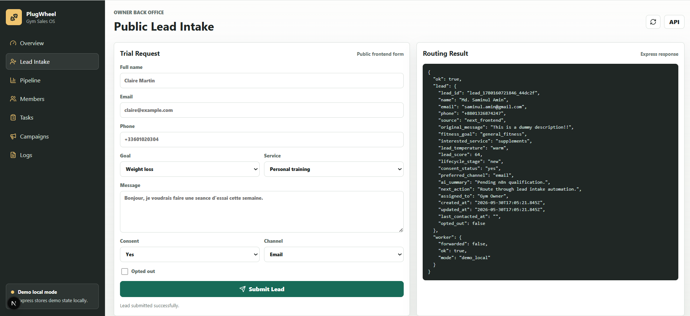 | 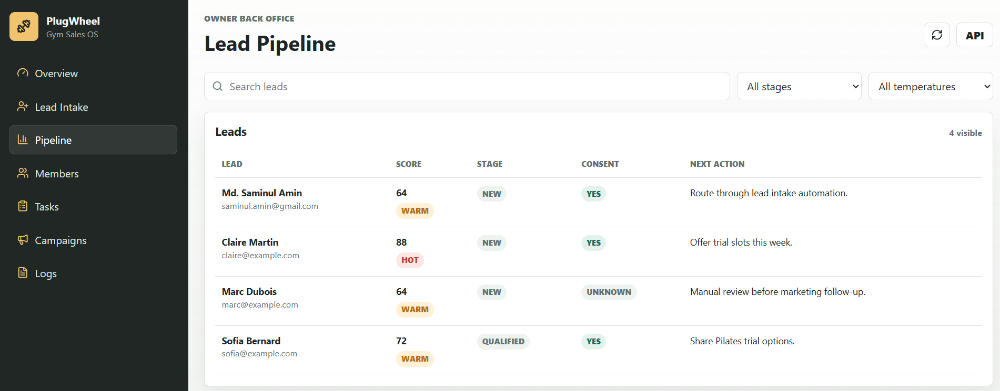 |

| Members | Tasks |
| --- | --- |
| 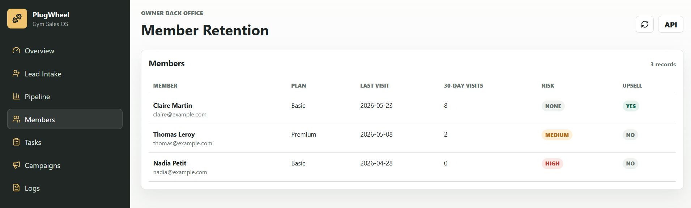 | 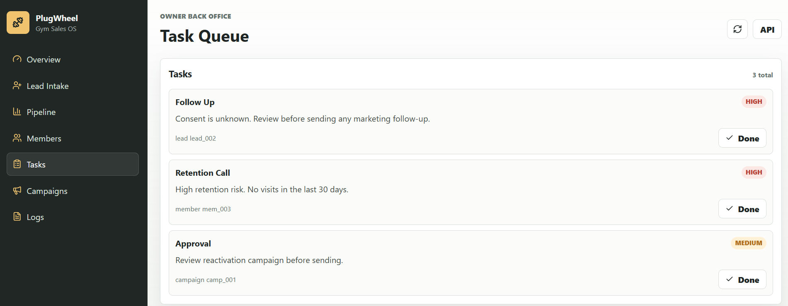 |

| Campaign Approvals | Automation Logs |
| --- | --- |
| 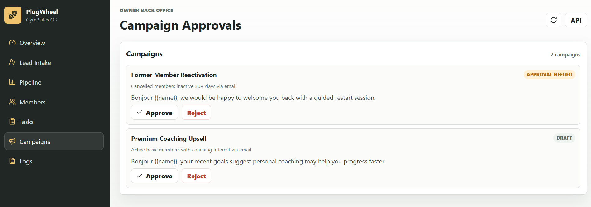 | 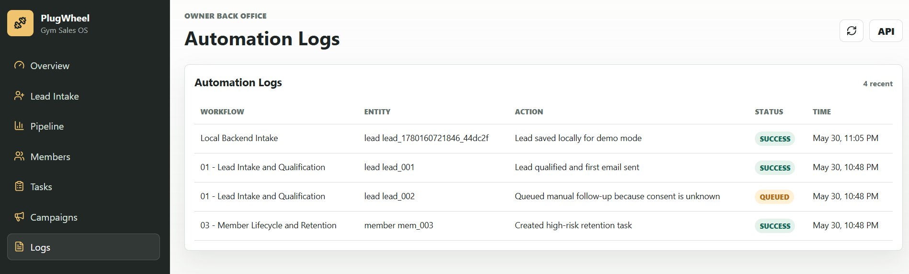 |

### n8n Workflow Gallery

| Workflow | Purpose | Preview |
| --- | --- | --- |
| `01 - Lead Intake and Qualification` | Capture, validate, dedupe, qualify, score, save, follow up, and log leads | 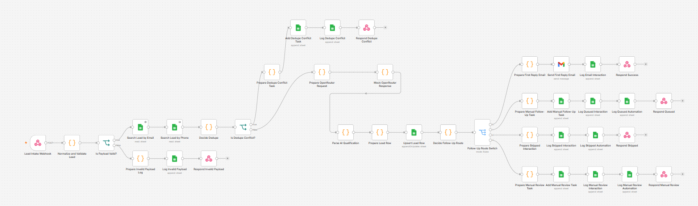 |
| `02 - Booking and Trial Follow-Up` | Send trial options, book selected slots, send reminders, and process trial outcomes | 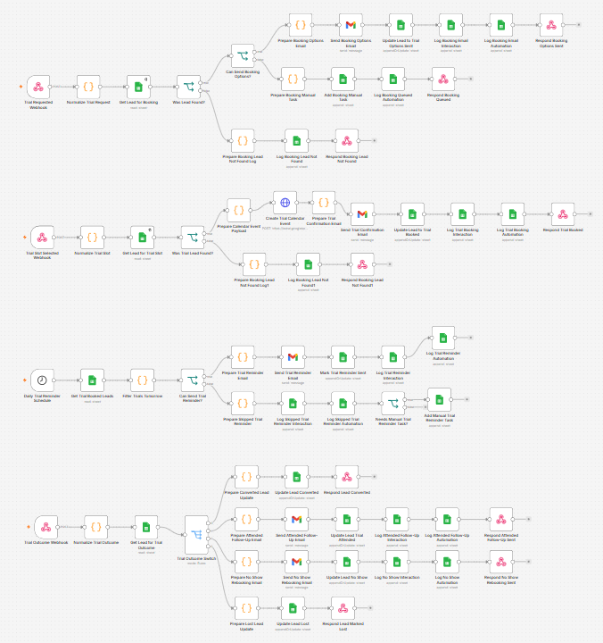 |
| `03 - Member Lifecycle and Retention` | Onboard members, update attendance, detect retention risk, and request reviews | 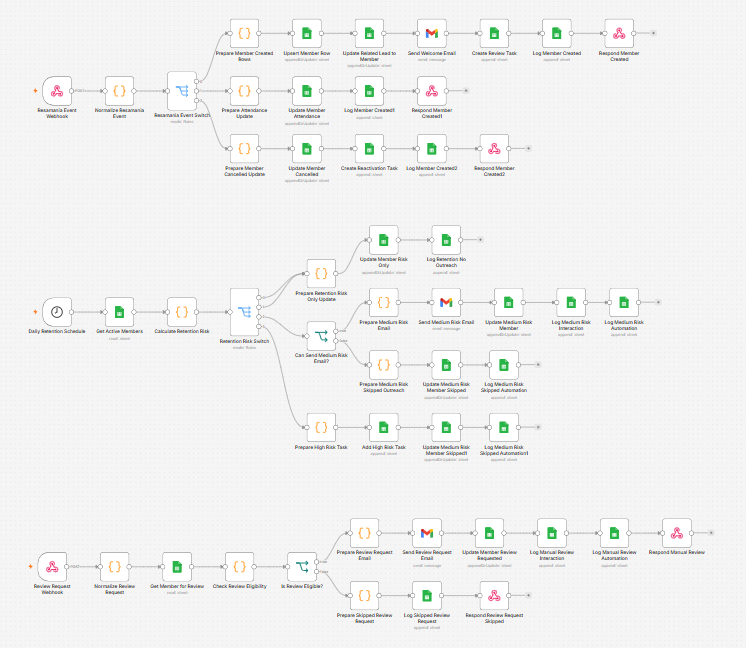 |
| `04 - Campaign Approval and Sending` | Generate reactivation and upsell campaigns, queue approval, and send approved messages | 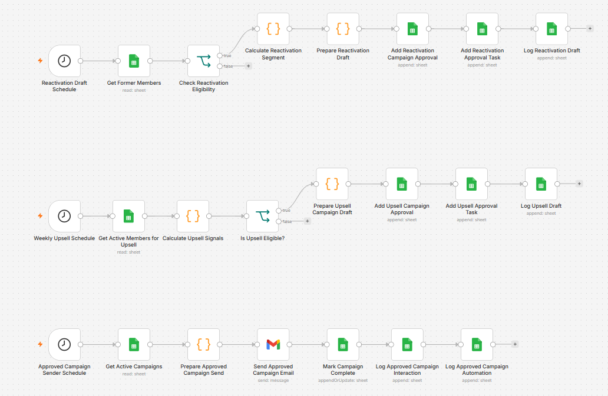 |

## System Architecture

```text
Lead sources / staff actions / mock Resamania events
        |
        v
Cloudflare Worker webhook router
        |
        v
n8n automation workflows
        |
        +--> Google Sheets CRM
        +--> OpenRouter structured AI responses
        +--> Gmail follow-up messages
        +--> Google Calendar trial bookings
        |
        v
Express API
        |
        v
Next.js owner dashboard
```

## Tech Stack

| Area | Technology |
| --- | --- |
| Frontend | Next.js 16, React 19, lucide-react |
| Backend | Express.js |
| Automation | n8n |
| AI | OpenRouter structured outputs |
| Webhook router | Cloudflare Workers |
| CRM storage | Google Sheets |
| Email | Gmail, with Brevo-ready architecture |
| Scheduling | Google Calendar |
| Testing | Postman, local API checks, build checks |

## Core Modules

| Module | What It Does |
| --- | --- |
| Lead Qualification | Normalizes webhook payloads, validates consent, dedupes leads, calls OpenRouter, and saves lead intelligence |
| Booking Automation | Sends trial options, receives selected slots, creates calendar events, and confirms bookings |
| Retention Engine | Tracks attendance, flags inactive members, creates owner tasks, and sends compliant re-engagement messages |
| Review Workflow | Sends Google review requests only when eligibility and cooldown rules are satisfied |
| Campaign Approval | Creates reactivation and upsell drafts, queues approval tasks, and sends only approved campaigns |
| Owner Dashboard | Presents pipeline, member risk, tasks, approvals, logs, and demo lead intake in one polished UI |

## Repository Structure

```text
apps/frontend/              Next.js owner dashboard
src/backend/                Express API and local demo data store
src/cloudflare-worker/      Cloudflare Worker webhook router
n8n/                        n8n workflow blueprints and node setup guide
docs/                       Project, setup, schema, and implementation docs
data/                       Sample CRM rows and mock Resamania payloads
images/                     Dashboard and workflow screenshots
postman/                    Postman collection and environment
prompts/                    OpenRouter prompt templates
schemas/                    Structured AI response schemas
templates/                  Email and campaign message templates
```

## Quick Start

### 1. Install Dependencies

```powershell
npm.cmd install
```

### 2. Run Frontend and Backend

```powershell
npm.cmd run app:dev
```

Open:

```text
http://localhost:3000
```

Backend health check:

```text
http://localhost:4000/api/health
```

### 3. Run Frontend and Backend Separately

Backend:

```powershell
npm.cmd run backend:dev
```

Frontend:

```powershell
npm.cmd run frontend:dev
```

If another local service is already using port `4000`, run this project backend on another port:

```powershell
$env:BACKEND_PORT='4001'
npm.cmd run backend:dev
```

Then point the frontend at that backend:

```powershell
$env:NEXT_PUBLIC_BACKEND_URL='http://localhost:4001'
npm.cmd run frontend:dev
```

## n8n Setup

Create these workflows in n8n:

1. `01 - Lead Intake and Qualification`
2. `02 - Booking and Trial Follow-Up`
3. `03 - Member Lifecycle and Retention`
4. `04 - Campaign Approval and Sending`
5. `99 - Error Handler`

The detailed node-by-node guide is here:

```text
n8n/node-setup-guide.md
```

For local n8n testing on Windows PowerShell:

```powershell
$env:N8N_SECURE_COOKIE='false'
n8n
```

Open:

```text
http://localhost:5678
```

If a deployed Cloudflare Worker must reach local n8n, expose n8n temporarily with Cloudflare Tunnel:

```powershell
cloudflared tunnel --url http://localhost:5678
```

## Cloudflare Worker

The Worker gives the project stable public webhook routes and forwards events to n8n.

Worker source:

```text
src/cloudflare-worker/worker.js
```

Deployment guide:

```text
docs/cloudflare-worker-setup.md
```

Required Worker secrets:

```powershell
wrangler secret put WEBHOOK_SHARED_SECRET
wrangler secret put N8N_LEAD_WEBHOOK_URL
wrangler secret put N8N_RESAMANIA_WEBHOOK_URL
wrangler secret put N8N_INTERACTION_WEBHOOK_URL
wrangler secret put N8N_OUTBOUND_TOKEN
```

## Environment Variables

Use `.env.example` as the template for local and deployment configuration.

```text
.env.example
```

Local secrets and runtime files are intentionally ignored:

- `.env`
- `.env.local`
- `src/cloudflare-worker/.dev.vars`
- `data/app-state.json`
- `.next/`
- `.wrangler/`
- `node_modules/`

## Quality Checks

Run:

```powershell
npm.cmd test
```

The test command checks:

- Cloudflare Worker syntax
- Express backend syntax
- Local data-store syntax
- Next.js production build

## Documentation Map

| File | Purpose |
| --- | --- |
| `docs/project-brief.md` | Portfolio brief, scope, and MVP acceptance criteria |
| `docs/implementation-guidelines.md` | Complete build order and implementation guide |
| `docs/google-sheets-schema.md` | Google Sheets CRM schema |
| `docs/openrouter-n8n-http.md` | OpenRouter setup for n8n HTTP Request nodes |
| `docs/cloudflare-worker-setup.md` | Beginner-friendly Cloudflare Worker guide |
| `docs/frontend-backend-app.md` | Frontend/backend architecture and local run guide |
| `docs/dashboard-spec.md` | Dashboard behavior and view specification |
| `n8n/workflow-blueprints.md` | Workflow-level automation design |
| `n8n/node-setup-guide.md` | Detailed n8n node configuration guide |
| `postman/gym-sales-automation-os.postman_collection.json` | API and webhook test collection |

## Compliance and Automation Rules

- Do not send marketing or sales messages without consent.
- Always respect opt-out status.
- Log sent, queued, skipped, and failed actions.
- Validate structured AI output before using it downstream.
- Queue promotional or revenue-sensitive campaigns for owner approval.
- Keep prices, discounts, and business claims in controlled settings rather than free-form model prompts.

## Contact

### Md. Saminul Amin

- **GitHub:** [saminul-amin](https://github.com/saminul-amin)
- **LinkedIn:** [Md. Saminul Amin](https://www.linkedin.com/in/md-saminul-amin)
- **Email:** [saminul.amin@gmail.com](mailto:saminul.amin@gmail.com)

## Conclusion

Gym Sales Automation OS demonstrates how AI, workflow automation, and a focused owner dashboard can turn a fragmented gym sales process into a structured operating system. The project is designed to show practical automation thinking: clean lead handling, consent-aware communication, measurable retention workflows, approval-based campaigns, and documentation detailed enough for another builder to reproduce the system.
